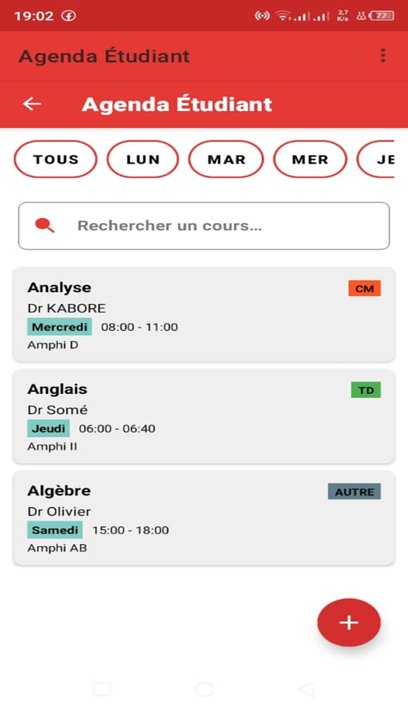
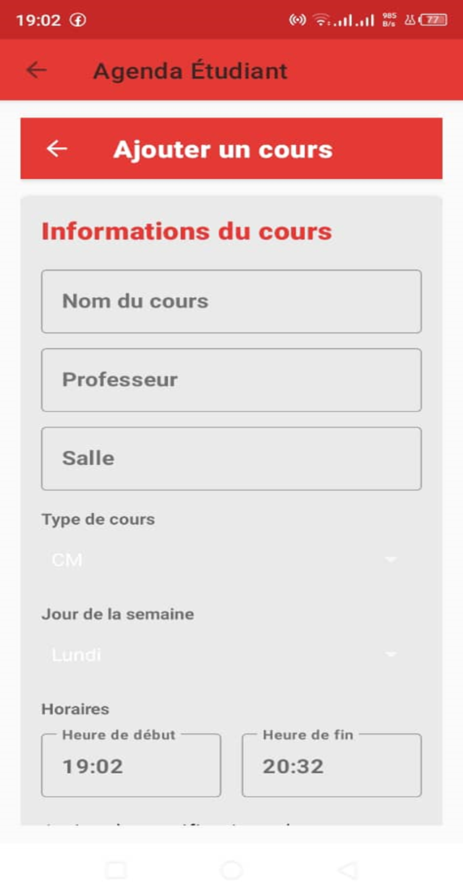

# Projet Dev Mobile – Agenda Étudiant

Application Android permettant aux étudiants d’organiser efficacement leurs cours grâce à un emploi du temps interactif, des notifications et une interface moderne basée sur Material Components.

---

## 1. Présentation du projet
L’application **Agenda Étudiant** a pour objectif de permettre aux étudiants de gérer leurs cours au quotidien :
- Visualisation des cours du jour
- Ajout, modification et suppression de cours
- Recherche et filtrage

Ce projet a été développé dans le cadre du module **Développement Mobile Android**.

---

## 2. Architecture du projet
Le projet adopte une architecture **MVVM** moderne intégrant :
- **Model** → Base de données Room
- **ViewModel** → Logique métier et gestion des données
- **View** → Activities, UI et interactions utilisateur
- **LiveData** → Mise à jour automatique de l’interface

---

## 3. Structure du projet

app/
├── src/main/java/com/example/studentagenda/
│   ├── data/
│   │   ├── CourseDao.java           # Interface DAO pour Room
│   │   ├── CourseDatabase.java      # Base Room
│   │   ├── CourseTypeConverter.java # Convertisseurs
│   │   └── entity/
│   │       └── Course.java         # Entité représentant un cours
│   │
│   ├── adapter/
│   │   └── CourseAdapter.java      # Adapter RecyclerView
│   │
│   ├── ui/
│   │   ├── MainActivity.java       # Écran principal
│   │   ├── AddEditCourseActivity.java # Ajout / modification
│   │   ├── CourseDetailActivity.java   # Détails d’un cours
│   │   └── viewmodel/
│   │       └── CourseViewModel.java   # ViewModel
│   │
│   └── notification/
│       ├── NotificationHelper.java       # Configuration des notifications
│       └── CourseNotificationReceiver.java # Déclenchement des rappels
│
└── res/
    ├── layout/   # Interfaces XML
    ├── menu/     # Menus
    └── values/   # Couleurs, thèmes, chaînes


---

## 4. Interface utilisateur
L’application utilise **Material Components** pour garantir :
- Une interface moderne et cohérente
- Des composants dynamiques et ergonomiques
- Une expérience fluide et intuitive

### Écrans proposés
- 🏠 **Écran principal** : liste des cours + recherche


- ➕ **Formulaire d’ajout** : saisie complète du cours


- 📘 **Détails d’un cours** : consultation + actions


---

## 5. Base de données (Room)

| Colonne               | Type    | Description               |
|-----------------------|--------|---------------------------|
| id                    | INTEGER | Identifiant unique       |
| name                  | TEXT    | Nom du cours             |
| professor             | TEXT    | Enseignant               |
| room                  | TEXT    | Salle                    |
| type                  | TEXT    | CM / TD / TP             |
| dayOfWeek             | INTEGER | Jour de 1 à 7            |
| startTime             | TEXT    | Heure début              |
| endTime               | TEXT    | Heure fin                |
| notificationEnabled   | INTEGER | 0/1 – rappel activé       |

---

## 6. Fonctionnalités principales
**Gestion des cours**
- Ajouter un cours
- Modifier un cours
- Supprimer un cours
- Consulter les détails

**Recherche et filtrage**
- Recherche textuelle
- Filtrage par jour de la semaine

**Interface fluide**
- RecyclerView performant
- Layouts optimisés
- Material Components

---

## 7. Installation du projet
### Cloner le dépôt
```bash
git clone https://github.com/tapsobarayanewende-web/projet-dev-mobile.git

Importer dans Android Studio

Ouvrir Android Studio

Open an existing project

Sélectionner le dossier cloné

Attendre la synchronisation Gradle

Lancer l’application sur un émulateur ou smartphone

8. Tests réalisés

Vérification de l’ajout / modification / suppression

Test des notifications programmées

Vérification des rotations d’écran (ViewModel)

Test du filtrage et de la recherche

9. Technologies utilisées

Java

Android SDK

Room Database

LiveData & ViewModel

Material Components

RecyclerView

10. Modalités de rendu (exigences respectées)

Dépôt GitHub public : projet-dev-mobile

Code source complet et commenté

Dossier complet du projet Android envoyé

README professionnel ajouté

Enseignant invité : djebarre

11. Auteur

Nom : TAPSOBA Rayagnewende Yacinthe

Niveau / filière : Licence 3 / Mathématiques et informatique

Projet : Développement Mobile d’une application “Agenda Étudiant”


